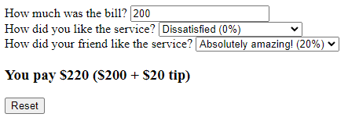

# Tip Calculator

The challenge was to create a tip calculator which receives an input for the bill amount, the satisfaction of the service for you and for your friend, and to calculate the tip based on the average of both your satisfaction levels.

  

